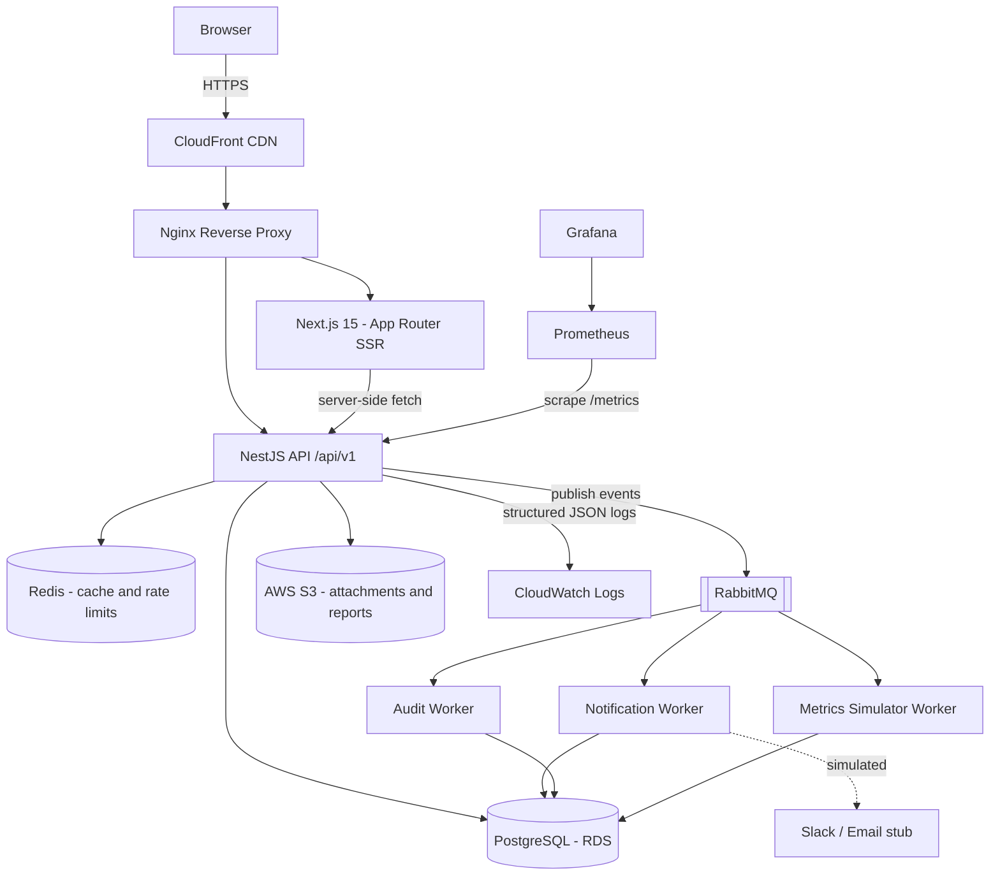

# System Architecture — High-Level Design (HLD)

**Product:** OpsPilot AI
**Version:** 1.0 (MVP → Phase 2)
**Last updated:** 2026-07-07

---

## 1. Architecture overview

OpsPilot AI is a modular monolith backend (NestJS) with a server-rendered React frontend (Next.js), backed by PostgreSQL as the source of truth, Redis for caching, and RabbitMQ for asynchronous side effects. It is intentionally **not** microservices in the MVP: a well-modularized monolith is faster to build, cheaper to run, and each NestJS module (auth, incidents, deployments, notifications) can be extracted into a service later. This is a defensible senior-level decision — say it exactly this way in interviews.



## 2. Component responsibilities

### 2.1 Frontend — Next.js 15 (App Router)

- SSR for the dashboard and incident list (fast first paint, SEO irrelevant here but SSR demonstrates the skill and improves TTFB for data-heavy pages).
- TanStack Query for client-side data fetching: caching, retries, optimistic updates on incident status changes.
- Zustand for lightweight global state (session user, theme).
- React Hook Form + Zod for forms; the same Zod schemas are shared with the API via a `packages/types` workspace package — single source of validation truth.
- Route groups: `(auth)` for login/signup, `(app)` for the authenticated shell.

### 2.2 Backend — NestJS (modular monolith)

Modules and their boundaries:

| Module | Owns | Publishes events |
|---|---|---|
| `auth` | signup/login, JWT issue/refresh/revoke, RBAC guards | `user.registered` |
| `users` | profiles, role management | `user.role_changed` |
| `orgs` | organizations, projects, memberships | — |
| `incidents` | incident CRUD, status machine, comments, timeline | `incident.created`, `incident.assigned`, `incident.status_changed`, `incident.commented` |
| `deployments` | deployment records, API-key ingestion | `deployment.recorded`, `deployment.failed` |
| `dashboard` | aggregate/read models, Redis-cached | — |
| `notifications` | notification persistence + read state | — (consumes) |
| `audit` | append-only audit log | — (consumes) |
| `metrics` | SystemMetrics read API, Prometheus registry | — |

Cross-cutting concerns implemented as Nest providers: global exception filter (RFC 7807 problem+json errors), logging interceptor (request ID, latency), `ThrottlerGuard` (rate limiting, Redis-backed), validation pipe.

### 2.3 Asynchronous processing — RabbitMQ

Pattern: **transactional write → publish domain event → workers consume**.

- Exchange: `opspilot.events` (topic).
- Routing keys mirror event names (`incident.status_changed`).
- Queues: `q.notifications`, `q.audit`, each with a dead-letter queue (`q.notifications.dlq`) and retry via TTL backoff (3 attempts).
- Why: creating an incident must not wait on email/Slack/audit writes. API responds in ~50 ms; side effects settle within seconds. Failure of a worker never fails a user request.

### 2.4 Caching — Redis

| Key pattern | Content | TTL | Invalidation |
|---|---|---|---|
| `dash:summary:{projectId}` | incident counts, deploy success rate | 60 s | on incident/deployment write (delete key) |
| `dash:activity:{projectId}` | recent timeline events | 30 s | TTL only |
| `rate:{ip}:{route}` | rate-limit counters | window | automatic |
| `refresh:{tokenId}` | refresh-token allowlist entry | 7 d | on logout/rotation |

Strategy: cache-aside with explicit invalidation on writes. Cold path always works — Redis down degrades to direct DB reads (circuit-break with a 100 ms Redis timeout), which is Incident #6 in the challenge log.

### 2.5 Data — PostgreSQL

Source of truth for all business entities. Design principles:

- Append-only tables for `IncidentTimelineEvent` and `AuditLog` (no updates/deletes).
- Composite indexes matching real query shapes (see DB design doc).
- Prisma migrations, versioned in the repo, applied in CI before deploy.
- Seed script generates 1M incidents for the indexing/performance case study.

### 2.6 Authentication & authorization

```
Login ──▶ access JWT (15 min, in memory) + refresh token (7 d, httpOnly secure cookie)
        └▶ refresh tokens stored hashed in Postgres + allowlisted in Redis
Rotation: every refresh issues a new refresh token and revokes the old (replay detection).
RBAC: role claim in JWT → Nest guard + decorator (@Roles('ADMIN','ENGINEER')).
Machine access: API keys (hashed) for CI deployment ingestion, scoped per project.
```

## 3. API design

- REST, versioned: `/api/v1/...`, OpenAPI generated by Nest Swagger module.
- Errors: `application/problem+json` with stable `code` values.
- Pagination: `?page=1&pageSize=25` → `{ data, meta: { total, page, pageSize } }`.
- Idempotency: deployment ingestion accepts `Idempotency-Key` header (stored in Redis 24 h).

Representative endpoints:

```
POST   /api/v1/auth/signup | login | refresh | logout
GET    /api/v1/incidents?status=OPEN&severity=SEV1&projectId=&q=&page=
POST   /api/v1/incidents
PATCH  /api/v1/incidents/:id/status
POST   /api/v1/incidents/:id/comments
GET    /api/v1/incidents/:id/timeline
POST   /api/v1/deployments            (JWT or X-API-Key)
GET    /api/v1/dashboard/summary?projectId=
GET    /api/v1/metrics/system?service=&from=&to=
GET    /metrics                        (Prometheus, unauthenticated, internal only)
```

## 4. Deployment architecture (AWS)

MVP topology (cost ≈ free tier / minimal):

```
Route53 → CloudFront → ALB (or Nginx on EC2)
   EC2 (t3.small): Docker Compose — web, api, workers, nginx, prometheus, grafana
   RDS PostgreSQL (t4g.micro), Redis (ElastiCache t4g.micro or container in MVP)
   S3: attachments + performance reports        ECR: images
   Secrets Manager: DB URL, JWT secrets         CloudWatch: logs + alarms
```

Stretch goal (Phase 2+): split to ECS Fargate services (web, api, worker) behind ALB, Terraform-managed.

### CI/CD (GitHub Actions)

```
PR:    lint → typecheck → unit tests → build → docker build (no push)
main:  all of the above → push to ECR → SSH/SSM deploy → prisma migrate deploy
       → health check /api/v1/health → smoke tests → notify (Slack webhook)
       → on failure: redeploy previous image tag (automatic rollback)
```

Images tagged with git SHA; `previous` tag maintained for one-command rollback.

## 5. Observability

- **Metrics:** `prom-client` in NestJS — HTTP duration histogram, error counter, queue depth gauge, cache hit/miss counter. Grafana dashboard JSON committed to `infrastructure/grafana/`.
- **Logs:** pino structured JSON (requestId, userId, route, latency). Shipped to CloudWatch. Log levels: info in prod, debug behind env flag.
- **Alerts:** Grafana alert rules — p95 latency > 1 s (5 min), error rate > 2%, DLQ depth > 0.
- **Tracing (stretch):** OpenTelemetry SDK with console/OTLP exporter.

## 6. Security controls

- Helmet security headers, strict CORS allowlist, rate limiting (Redis-backed, per-IP + per-user).
- Input validation at the edge (Zod DTOs), Prisma parameterized queries (no SQL injection surface).
- Refresh tokens httpOnly + Secure + SameSite=Lax; access token never persisted to localStorage.
- Secrets only via env/Secrets Manager; `.env` git-ignored; gitleaks check in CI.
- Audit log for every mutating request (actor, entity, diff).
- Dependency scanning: `npm audit` + Dependabot in CI.

## 7. Failure modes & resilience

| Failure | Behavior | Mechanism |
|---|---|---|
| Redis down | Slower but functional | 100 ms timeout → fall through to DB; alert fires |
| RabbitMQ down | Requests still succeed | Outbox table: events written in the DB transaction, relayed when MQ returns |
| Worker crash | No data loss | Durable queues, manual ack, DLQ after 3 retries |
| Bad deploy | Auto rollback | Health-check gate + previous image tag |
| DB failover | Brief write errors | Retry with backoff on transient Prisma errors |

The **outbox pattern** above is a deliberate senior-level talking point: it solves the dual-write problem (DB commit succeeds but event publish fails).

## 8. Key architecture decisions (ADR summary)

| # | Decision | Alternatives | Rationale |
|---|---|---|---|
| ADR-001 | Modular monolith | Microservices | Team of 1; module boundaries preserve extraction path; avoids distributed-system tax |
| ADR-002 | PostgreSQL | MongoDB | Deeply relational domain (org→project→incident→timeline), transactions, reporting joins |
| ADR-003 | Redis cache-aside | Write-through, no cache | Simple invalidation, tolerates cache loss |
| ADR-004 | RabbitMQ | SQS, Kafka | Local dev parity via Docker, routing topology, DLQ semantics; Kafka is overkill for this volume |
| ADR-005 | Next.js App Router | SPA (Vite React) | SSR for data-heavy pages, server components reduce bundle, showcases current ecosystem |
| ADR-006 | JWT + rotating refresh | Server sessions | Stateless API scaling; rotation + allowlist mitigates token theft |
| ADR-007 | EC2 Compose first, ECS later | EKS | Cost + time; K8s adds no narrative value at this scale |
