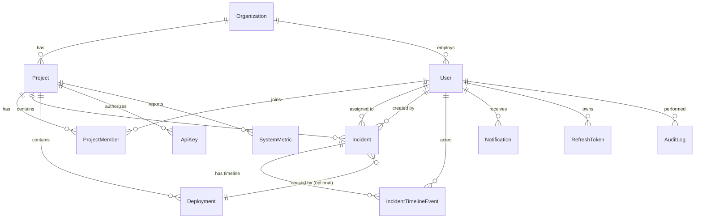

# Database Design — OpsPilot AI

**Database:** PostgreSQL 16 (AWS RDS)
**ORM:** Prisma
**Last updated:** 2026-07-07

---

## 1. Entity-Relationship overview



Design principles:

1. **Append-only history.** `IncidentTimelineEvent` and `AuditLog` are never updated or deleted — the timeline is the incident's legal record.
2. **Soft deletes** (`deletedAt`) on user-facing entities; hard deletes only via data-retention jobs.
3. **Indexes mirror query shapes.** Every index below maps to a named query in the API; nothing speculative.
4. **UUID v7 primary keys** — sortable by time (better index locality than v4), non-enumerable in URLs.

## 2. Prisma schema

```prisma
// prisma/schema.prisma

generator client {
  provider = "prisma-client-js"
}

datasource db {
  provider = "postgresql"
  url      = env("DATABASE_URL")
}

// ───────────────────────── Enums ─────────────────────────

enum Role {
  ADMIN
  ENGINEER
  VIEWER
}

enum IncidentSeverity {
  SEV1 // critical, all hands
  SEV2 // major, degraded core flow
  SEV3 // minor, workaround exists
  SEV4 // cosmetic / low
}

enum IncidentStatus {
  OPEN
  INVESTIGATING
  IDENTIFIED
  MONITORING
  RESOLVED
}

enum TimelineEventType {
  CREATED
  STATUS_CHANGED
  ASSIGNED
  COMMENT
  LINKED_DEPLOYMENT
  SEVERITY_CHANGED
}

enum DeploymentEnv {
  DEV
  STAGING
  PRODUCTION
}

enum DeploymentStatus {
  PENDING
  IN_PROGRESS
  SUCCESS
  FAILED
  ROLLED_BACK
}

enum NotificationType {
  INCIDENT_ASSIGNED
  INCIDENT_STATUS
  DEPLOYMENT_FAILED
  MENTION
}

// ───────────────────────── Core ─────────────────────────

model Organization {
  id        String   @id @default(uuid()) @db.Uuid
  name      String
  slug      String   @unique
  createdAt DateTime @default(now())
  updatedAt DateTime @updatedAt

  users    User[]
  projects Project[]
}

model User {
  id             String    @id @default(uuid()) @db.Uuid
  organizationId String    @db.Uuid
  email          String    @unique
  passwordHash   String
  fullName       String
  role           Role      @default(ENGINEER)
  avatarUrl      String?
  isActive       Boolean   @default(true)
  lastLoginAt    DateTime?
  createdAt      DateTime  @default(now())
  updatedAt      DateTime  @updatedAt
  deletedAt      DateTime?

  organization      Organization           @relation(fields: [organizationId], references: [id])
  memberships       ProjectMember[]
  createdIncidents  Incident[]             @relation("IncidentCreator")
  assignedIncidents Incident[]             @relation("IncidentAssignee")
  timelineEvents    IncidentTimelineEvent[]
  notifications     Notification[]
  refreshTokens     RefreshToken[]
  auditLogs         AuditLog[]

  @@index([organizationId])
}

model Project {
  id             String    @id @default(uuid()) @db.Uuid
  organizationId String    @db.Uuid
  name           String
  key            String    // short code used in incident numbers, e.g. "PAY"
  description    String?
  createdAt      DateTime  @default(now())
  updatedAt      DateTime  @updatedAt
  deletedAt      DateTime?

  organization Organization    @relation(fields: [organizationId], references: [id])
  members      ProjectMember[]
  incidents    Incident[]
  deployments  Deployment[]
  apiKeys      ApiKey[]
  metrics      SystemMetric[]

  @@unique([organizationId, key])
}

model ProjectMember {
  projectId String   @db.Uuid
  userId    String   @db.Uuid
  createdAt DateTime @default(now())

  project Project @relation(fields: [projectId], references: [id])
  user    User    @relation(fields: [userId], references: [id])

  @@id([projectId, userId])
  @@index([userId])
}

// ───────────────────────── Incidents ─────────────────────────

model Incident {
  id           String           @id @default(uuid()) @db.Uuid
  projectId    String           @db.Uuid
  number       Int              // per-project sequence → "PAY-42"
  title        String
  description  String
  severity     IncidentSeverity
  status       IncidentStatus   @default(OPEN)
  createdById  String           @db.Uuid
  assigneeId   String?          @db.Uuid
  deploymentId String?          @db.Uuid // suspected cause
  createdAt    DateTime         @default(now())
  updatedAt    DateTime         @updatedAt
  resolvedAt   DateTime?
  deletedAt    DateTime?

  project    Project                 @relation(fields: [projectId], references: [id])
  createdBy  User                    @relation("IncidentCreator", fields: [createdById], references: [id])
  assignee   User?                   @relation("IncidentAssignee", fields: [assigneeId], references: [id])
  deployment Deployment?             @relation(fields: [deploymentId], references: [id])
  timeline   IncidentTimelineEvent[]

  @@unique([projectId, number])
  // list view: WHERE projectId=? AND status=? ORDER BY createdAt DESC
  @@index([projectId, status, createdAt(sort: Desc)])
  // "my incidents": WHERE assigneeId=? AND status != RESOLVED
  @@index([assigneeId, status])
  // severity board: WHERE status=OPEN ORDER BY severity
  @@index([status, severity])
}

model IncidentTimelineEvent {
  id         String            @id @default(uuid()) @db.Uuid
  incidentId String            @db.Uuid
  actorId    String            @db.Uuid
  type       TimelineEventType
  // COMMENT → { text }, STATUS_CHANGED → { from, to }, ASSIGNED → { fromUserId, toUserId }
  payload    Json
  createdAt  DateTime          @default(now())

  incident Incident @relation(fields: [incidentId], references: [id])
  actor    User     @relation(fields: [actorId], references: [id])

  // timeline read: WHERE incidentId=? ORDER BY createdAt ASC
  @@index([incidentId, createdAt])
  // global activity feed
  @@index([createdAt(sort: Desc)])
}

// ───────────────────────── Deployments ─────────────────────────

model Deployment {
  id          String           @id @default(uuid()) @db.Uuid
  projectId   String           @db.Uuid
  version     String           // "v1.4.2" or git SHA
  environment DeploymentEnv
  status      DeploymentStatus @default(PENDING)
  triggeredBy String           // user email or "ci"
  commitSha   String?
  durationSec Int?
  startedAt   DateTime         @default(now())
  finishedAt  DateTime?
  metadata    Json? // pipeline URL, changelog, etc.

  project   Project    @relation(fields: [projectId], references: [id])
  incidents Incident[]

  // history view: WHERE projectId=? AND environment=? ORDER BY startedAt DESC
  @@index([projectId, environment, startedAt(sort: Desc)])
  // success-rate aggregate: WHERE startedAt > now()-30d GROUP BY status
  @@index([startedAt, status])
}

// ───────────────────────── Auth ─────────────────────────

model RefreshToken {
  id        String    @id @default(uuid()) @db.Uuid
  userId    String    @db.Uuid
  tokenHash String    @unique // sha256 of the token — never store raw
  expiresAt DateTime
  revokedAt DateTime?
  replacedBy String?  @db.Uuid // rotation chain → replay detection
  userAgent String?
  ip        String?
  createdAt DateTime  @default(now())

  user User @relation(fields: [userId], references: [id])

  @@index([userId, expiresAt])
}

model ApiKey {
  id         String    @id @default(uuid()) @db.Uuid
  projectId  String    @db.Uuid
  name       String
  keyHash    String    @unique
  prefix     String // first 8 chars, shown in UI: "opk_a1b2…"
  lastUsedAt DateTime?
  createdAt  DateTime  @default(now())
  revokedAt  DateTime?

  project Project @relation(fields: [projectId], references: [id])
}

// ───────────────────────── Async / audit ─────────────────────────

model Notification {
  id        String           @id @default(uuid()) @db.Uuid
  userId    String           @db.Uuid
  type      NotificationType
  title     String
  body      String
  link      String? // deep link: /incidents/PAY-42
  readAt    DateTime?
  createdAt DateTime         @default(now())

  user User @relation(fields: [userId], references: [id])

  // unread badge: WHERE userId=? AND readAt IS NULL
  @@index([userId, readAt, createdAt(sort: Desc)])
}

model AuditLog {
  id         String   @id @default(uuid()) @db.Uuid
  actorId    String?  @db.Uuid // null for system actions
  action     String   // "incident.status_changed"
  entityType String   // "Incident"
  entityId   String
  before     Json?
  after      Json?
  ip         String?
  createdAt  DateTime @default(now())

  actor User? @relation(fields: [actorId], references: [id])

  @@index([entityType, entityId, createdAt])
  @@index([actorId, createdAt])
}

// Outbox: solves dual-write (DB commit vs. MQ publish)
model OutboxEvent {
  id          String    @id @default(uuid()) @db.Uuid
  routingKey  String    // "incident.status_changed"
  payload     Json
  publishedAt DateTime?
  attempts    Int       @default(0)
  createdAt   DateTime  @default(now())

  @@index([publishedAt, createdAt]) // relay scans unpublished oldest-first
}

// ───────────────────────── Metrics (simulated in MVP) ─────────────────────────

model SystemMetric {
  id         BigInt   @id @default(autoincrement())
  projectId  String   @db.Uuid
  service    String   // "payment-api"
  metric     String   // "latency_p95_ms" | "error_rate" | "cpu" | "memory"
  value      Float
  recordedAt DateTime @default(now())

  project Project @relation(fields: [projectId], references: [id])

  // chart query: WHERE projectId=? AND service=? AND metric=? AND recordedAt BETWEEN
  @@index([projectId, service, metric, recordedAt])
}
```

## 3. Design decisions worth defending in interviews

**Per-project incident numbers (`PAY-42`).** Generated inside a transaction with `SELECT ... FOR UPDATE` on a per-project counter (or `MAX(number)+1` under serializable isolation). Talking point: why a global sequence is wrong (leaks volume across projects, renumbering pain) and how you avoided race conditions.

**JSON `payload` on timeline events.** One table for six event types instead of six tables. Trade-off: no FK integrity inside the payload — enforced at the application layer by shared Zod schemas per event type. Keeps the timeline read as a single indexed scan.

**Outbox table.** If the API wrote to Postgres and published to RabbitMQ separately, a crash between the two would lose events. Instead: business write + outbox row in one transaction; a relay worker publishes and marks `publishedAt`. At-least-once delivery; consumers are idempotent.

**`SystemMetric` as BigInt autoincrement, not UUID.** High-volume, insert-heavy, never referenced externally — sequential integer PK is smaller and faster. Candidate for monthly partitioning at scale (`PARTITION BY RANGE (recordedAt)`), which is your Challenge #3 case study.

**Hash, never store, tokens and API keys.** DB leak ≠ credential leak. Prefix column exists purely so the UI can display "opk_a1b2…".

## 4. Performance case-study plan (seed + measure)

This creates the honest before/after numbers for your portfolio:

1. `prisma/seed-load.ts` generates 1M incidents, 5M timeline events, 2M metrics rows.
2. Run the incident list query **without** `@@index([projectId, status, createdAt])` → capture `EXPLAIN ANALYZE` (expect Seq Scan, multi-second).
3. Add the index via migration → re-run `EXPLAIN ANALYZE` (expect Index Scan, <150 ms).
4. Commit both EXPLAIN outputs to `docs/perf/incident-list-indexing.md`.

Repeat the pattern for: dashboard aggregates (before/after Redis) and metric range queries (before/after partitioning — Phase 3).

## 5. Migration & data-safety policy

- All schema changes via `prisma migrate dev` locally, `prisma migrate deploy` in CI — never `db push` in shared environments.
- Expand-and-contract for breaking changes: add nullable column → backfill → enforce NOT NULL → remove old column in a later release (zero-downtime).
- Every destructive migration ships with a rollback note in `docs/runbook.md`.
- RDS automated snapshots daily, 7-day retention; restore drill documented once.
